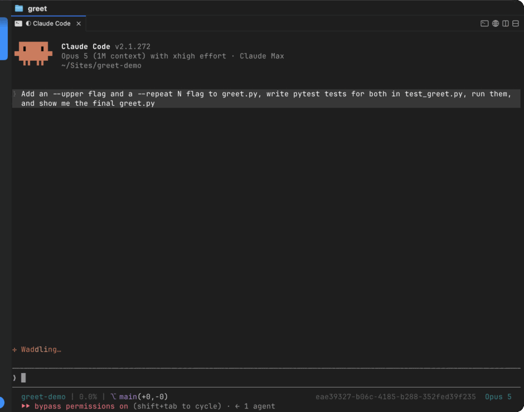

# cmux-claude-queue

Queue your next prompt for [Claude Code](https://claude.com/claude-code) with one keypress, and
have it arrive as a fresh turn — after the current one has actually finished.



<sub>`Option+Enter` instead of `Enter`: the draft leaves the box, waits in the statusline, and arrives as its own turn.</sub>

macOS · [cmux](https://cmux.io) · MIT

## Why

Claude Code already queues what you type mid-turn. The catch is *when* it hands it over:

> if you queue a message while Claude is running tool calls, Claude Code passes it to Claude **as
> soon as those tool calls finish, within the same turn**
>
> — [Claude Code docs](https://code.claude.com/docs/en/interactive-mode#when-claude-code-sends-what-you-queued)

So "do this next" can land in the middle of the work it was meant to follow. Codex CLI's queue
draws the same line — its own hint reads *"Messages to be submitted after next tool call"*.
Neither waits for the turn to be over.

This keeps the prompt outside Claude Code entirely: on disk, per cmux session, submitted as a
brand-new turn only once the current one has genuinely ended — and confirmed before it leaves
the queue, so nothing is sent twice and nothing is silently dropped.

People have been asking for this for a while:
[#50246](https://github.com/anthropics/claude-code/issues/50246) (205 👍),
[#33323](https://github.com/anthropics/claude-code/issues/33323),
[#30677](https://github.com/anthropics/claude-code/issues/30677),
[#63190](https://github.com/anthropics/claude-code/issues/63190).

## Use it

| Key | What happens |
| --- | --- |
| `Opt+Enter` | Queues the draft. Box clears in ~60 ms, the statusline shows `⏳ Queue: …` |
| `Opt+Shift+Enter` | Opens the queue manager — `↑↓` select, `e` edit, `d` delete, `q` close |
| `Ctrl+G` | Optional: queues the draft *exactly* as typed, blank lines included |
| `!qq text` | Optional: queues from Claude Code's `!` bash mode, without leaving the keyboard |

On an idle session `Opt+Enter` just submits, like a plain Enter. Queues are FIFO and per cmux
surface, so every session has its own and a prompt can only land where it was captured.

Outside cmux, both combos behave normally — the hotkey is registered only while cmux is
frontmost.

## Install

```sh
git clone https://github.com/Vesely/cmux-claude-queue
cd cmux-claude-queue
./install.sh
```

The installer copies `bin/cmux-claude-queue` into `~/.local/bin` (re-run after `git pull` to
upgrade; `--dev` symlinks instead), builds the daemon, loads the LaunchAgent, and prints the two
config snippets you add yourself:

1. **`~/.config/cmux/cmux.json`** — `automation.socketControlMode: "password"` with a generated
   `automation.socketPassword`, and `cmux-claude-queue notifyhook` under `notifications.hooks`.
   Then `cmux reload-config`.
2. **`~/.claude/settings.json`** — point `statusLine.command` at `cmux-claude-queue statusline`
   with `refreshInterval: 1`.

Already have a statusline? Save it as `~/.config/cmux-claude-queue/statusline-chain` and it keeps
running, cached, with the queue row appended below it.

> **Note on password mode.** Any process that can read your `cmux.json` can then control your
> cmux terminals. The file is `600` in your home directory — the same trust boundary as your
> shell startup files — but it is a wider gate than cmux's default `cmuxOnly` mode. The hotkey
> daemon is not a cmux child process, so `cmuxOnly` rejects it.

## Requirements

macOS · [cmux](https://github.com/manaflow-ai/cmux) ≥ 0.64.20 · Claude Code ·
Xcode Command Line Tools (for `swiftc`) · `python3` on `$PATH`

## Limitations

- One Claude session per cmux workspace (the capture targets the workspace's active Claude surface).
- A cmux restart regenerates surface ids; prompts still queued then are orphaned in
  `~/.claude/prompt-queue/` — never misdelivered, just left behind.
- Multi-line drafts are joined into one line when captured off the screen. `Ctrl+G` preserves them
  on the way in, but delivery still joins them.
- Ghostty support is stubbed in the daemon but needs a capture backend.

## Uninstall

```sh
launchctl bootout gui/$(id -u)/com.cmux-claude-queue.hotkeyd
rm ~/Library/LaunchAgents/com.cmux-claude-queue.hotkeyd.plist
rm -f ~/.local/bin/cmux-claude-queue ~/.local/bin/cmux-claude-queue-hotkeyd \
      ~/.local/bin/cmux-claude-queue-editor
rm -rf ~/.claude/prompt-queue ~/.config/cmux-claude-queue
```

Then drop the `notifications.hooks` entry from `cmux.json` and restore your previous
`statusLine` in Claude Code's `settings.json`.

## More

[How it works, and why](docs/internals.md) — architecture, the delivery guarantees, performance
notes, and the `Ctrl+G` setup.

## License

MIT
